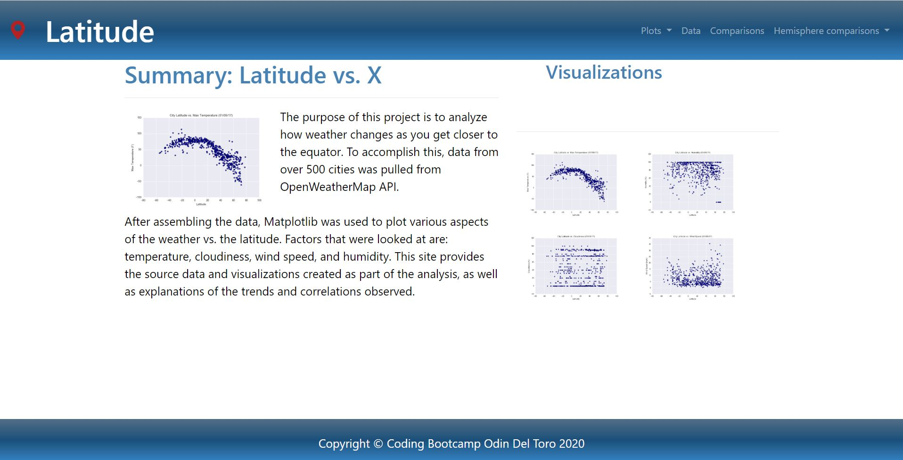
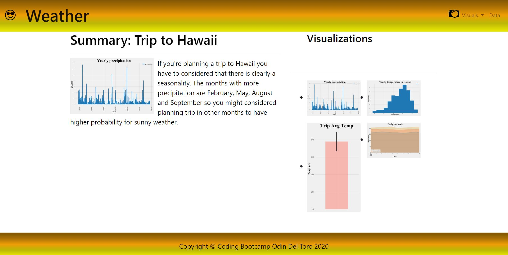

# Weather Latitude Dashboard
## Objective: 

Create a visualization dashboard website using HTML, CSS and Bootstrap with data from OpenWeather API. Data shows temperature, humidity, cloudiness and wind speed in several cities relating them to its latitude.

## Bonus:

Create a visualization dashboard website using HTML, CSS and Bootstrap with weather data form 9 stations for planning a trip to Hawaii considering temperature and precipitation.

